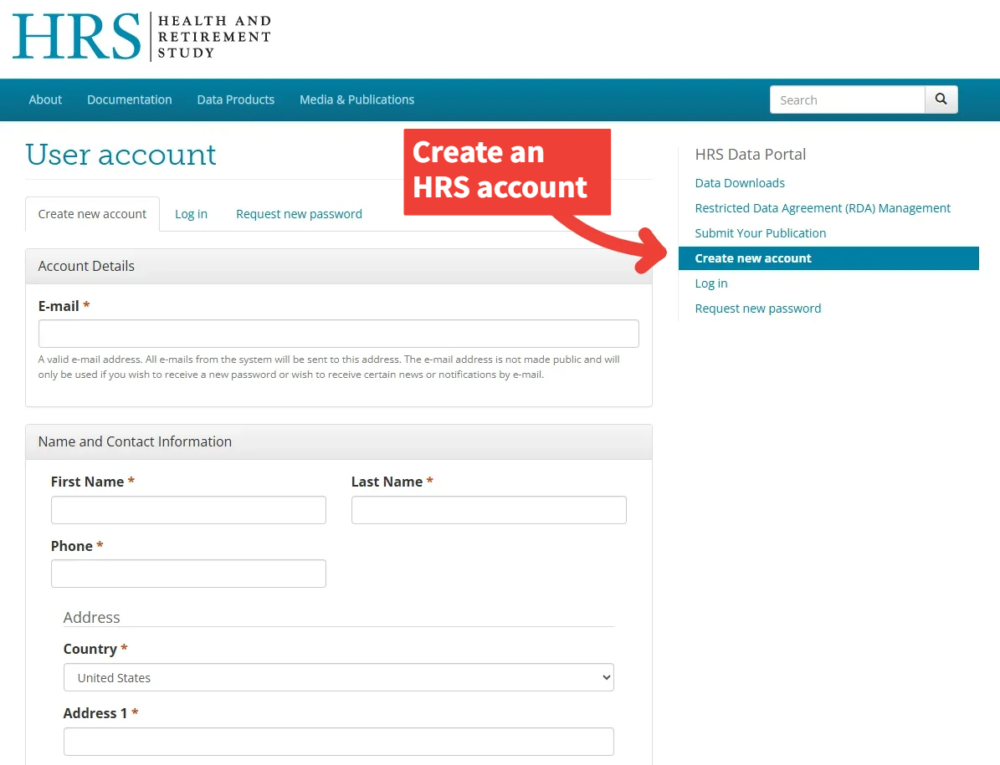
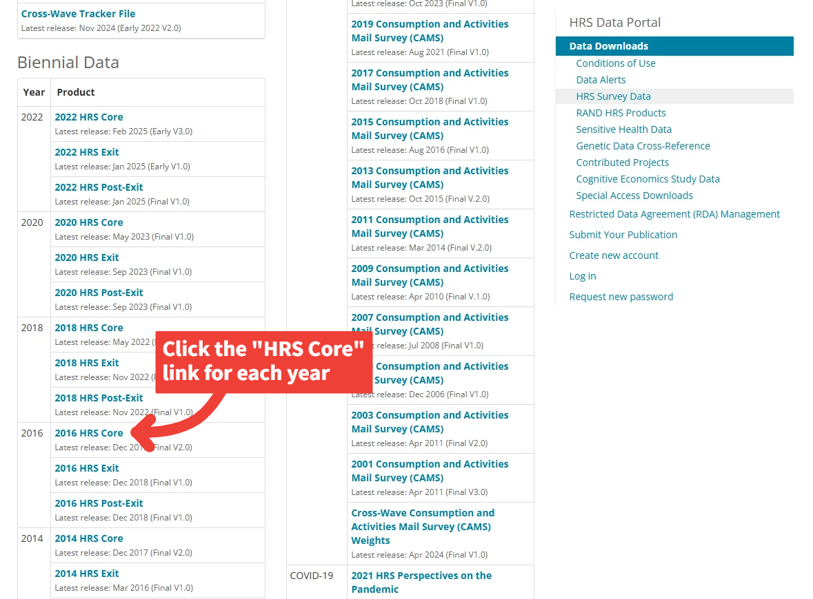
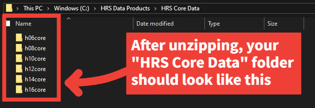
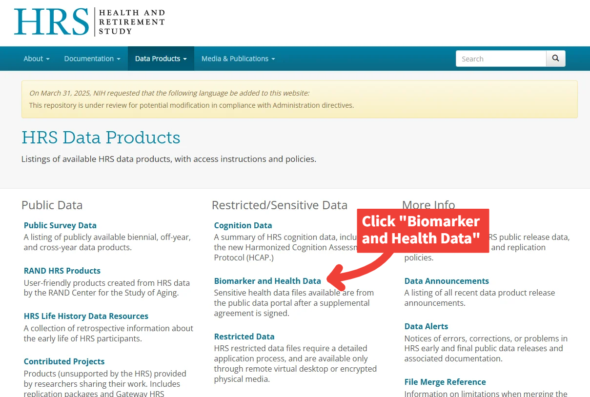
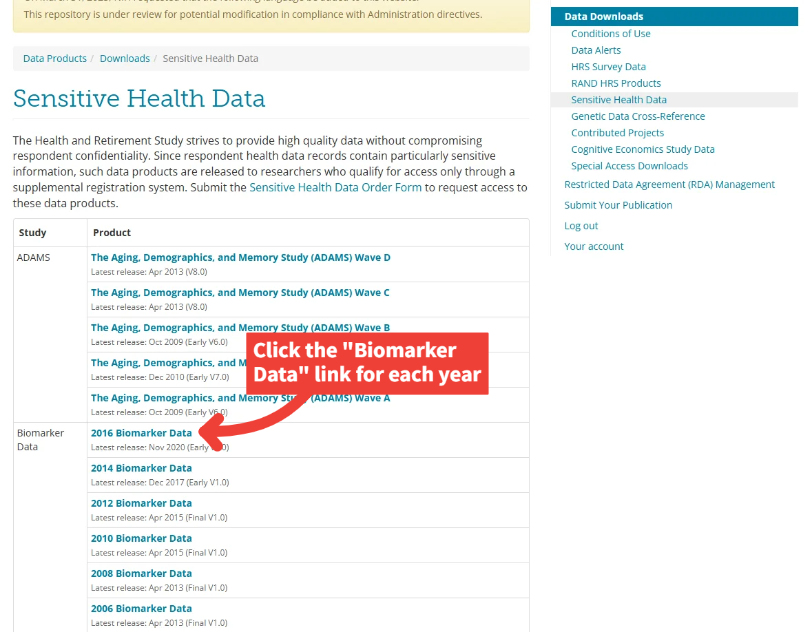
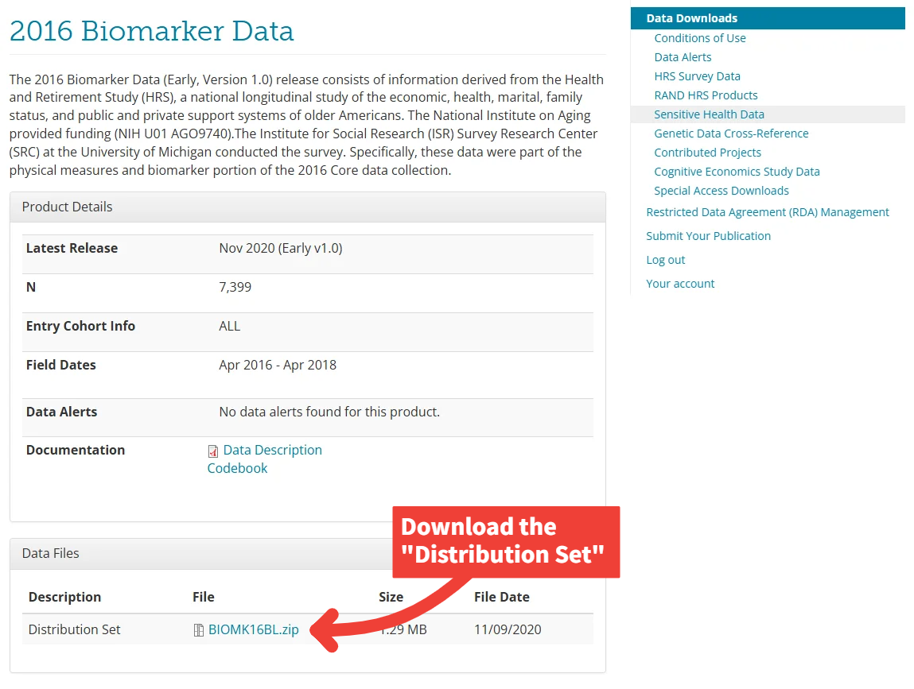
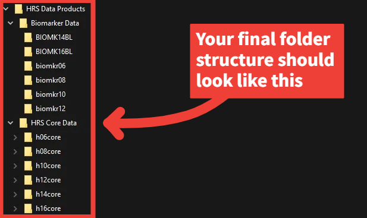

 

# HRS Data Access Guide  
*CHORDS Lab – Washington State University*

_Last updated: [2025-07-09]_

This guide walks through the process of downloading and organizing the raw data files needed to run the data preparation scripts in this repository. These steps will allow you to reproduce our processing pipeline and generate a clean, analysis-ready allostatic load dataset using publicly available and restricted-access data from the **Health and Retirement Study (HRS)**.

---

## 📁 Final Folder Structure (Preview)

Once you've downloaded and extracted the required files, your local directory should resemble the following:

    HRS Data Products/  
    ├── HRS Core Data/  
    │ ├── h06core/  
    │ ├── h08core/  
    │ ├── h10core/  
    │ ├── h12core/  
    │ ├── h14core/  
    │ └── h16core/  
    ├── Biomarker Data/  
    │ ├── BIOMK14BL/  
    │ ├── BIOMK16BL/  
    │ ├── biomkr06/  
    │ ├── biomkr08/  
    │ ├── biomkr10/  
    │ ├── biomkr12/    

---

## 1. Account Setup & Data Access Permissions

Before downloading, you'll need to:

1. Create an account at the [HRS website](https://hrs.isr.umich.edu/).
2. Request access to restricted/sensitive data, including biomarker files.
   - Once approved, HRS will email you individual **passphrases** for each biomarker file.

 

## 2. Download HRS Core Data

Visit the [HRS Public Survey Data](https://hrsdata.isr.umich.edu/data-products/public-survey-data) page and download the **Core Distribution Sets** for years 2006-2016.

  

 

Click the **HRS Core** link for each year (2006-2016).

   

 

Download the **Distribution Set** for each year (2006-2016).

  

#### Alternatively, you may use the following direct links to download each `HRS Core` distribution set:
- [2006 HRS Core](https://hrsdata.isr.umich.edu/data-file-download/9482)
- [2008 HRS Core](https://hrsdata.isr.umich.edu/data-file-download/5435)
- [2010 HRS Core](https://hrsdata.isr.umich.edu/data-file-download/9465)
- [2012 HRS Core](https://hrsdata.isr.umich.edu/data-file-download/5446)
- [2014 HRS Core](https://hrsdata.isr.umich.edu/data-file-download/5448)
- [2016 HRS Core](https://hrsdata.isr.umich.edu/data-file-download/14963)  

---

### Unzipping HRS Core Data

**Setup Instructions:**
- Create a folder called `HRS Core Data/`
- Unzip each file into its own subfolder inside that directory (`h06core/`, `h08core/`, etc.)
- Each `.zip` file may contain nested `.zip` files—be sure to unzip those as well. If you're using a batch extractor, this will be handled automatically, but double-check that all subfolders are extracted

💡 _Need help unzipping multiple files at once?_ Try [7-Zip](https://www.7-zip.org/) (Windows) or [The Unarchiver](https://theunarchiver.com/) (Mac) for batch extraction.

 

---

## 3. Download Biomarker Data

Once you've been approved for biomarker access and received the passphrase(s), visit the [Biomarker and Health Data](https://hrsdata.isr.umich.edu/data-products/sensitive-health) page and download the **Biomarker Data Distribution Sets for years 2006-2016**.

 

 

Click the **Biomarker Data** link for each year (2006-2016).

 

 

Download the **Distribution Set** for each year (2006-2016).

 

#### Alternatively, you may use the following direct links as a shortcut to download each `Biomarker Data` set:
- [2016 Biomarker Data](https://hrsdata.isr.umich.edu/data-file-download/6649)
- [2014 Biomarker Data](https://hrsdata.isr.umich.edu/data-file-download/5615)
- [2012 Biomarker Data](https://hrsdata.isr.umich.edu/data-file-download/5700)
- [2010 Biomarker Data](https://hrsdata.isr.umich.edu/data-file-download/5704)
- [2008 Biomarker Data](https://hrsdata.isr.umich.edu/data-file-download/5717)
- [2006 Biomarker Data](https://hrsdata.isr.umich.edu/data-file-download/5711)

---

### Unzipping HRS Biomarker Data

**Setup Instructions:**
- Create a folder called `Biomarker Data/`
- Unzip each distribution set into its own subfolder (`biomkr06/`, `BIOMK14BL`, etc.)
- Each zip will prompt for a **passphrase** (provided via email from HRS).

---

## ✅ Setup Complete -- Proceed to Dataset Construction

 

 

Once your data is organized, you’re ready to run the [`HRS_dataset_construction.Rmd`](HRS_dataset_construction.Rmd) script located in the `/HRS` directory. This script will generate the final, cleaned allostatic load dataset.

If you encounter issues or need assistance with data access or permissions, contact the [HRS Help Desk](https://hrs.isr.umich.edu/help).

---

