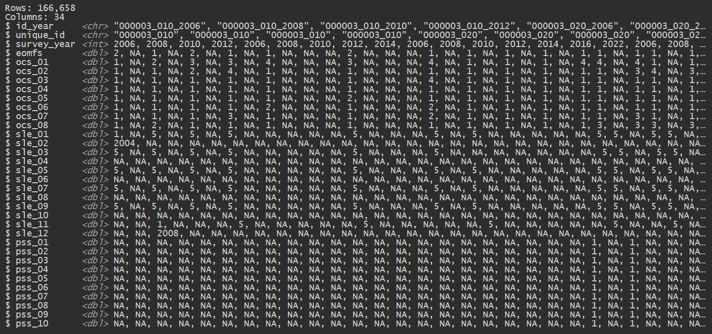

# HRS_stress_subset
*CHORDS Lab – Washington State University*  

_Last updated: [2025-08-30]_  

## Contents  

- [`HRS_stress_access_guide.md`](HRS_stress_access_guide.md)  
  Instructions for accessing and downloading raw stress data from the [Health and Retirement Study (HRS)](https://hrs.isr.umich.edu/).

- [`HRS_stress_dataset_construction.Rmd`](HRS_dataset_construction.Rmd)  
  R Markdown script that compiles and processes HRS stress data across multiple waves (2006–2022). The resulting supplementary stress dataset may be joined with the HRS Allostatic (over)Load dataset built in `HRS_dataset_construction.Rmd`, using the common key `id_year`.

## Variable Naming Conventions  

The following conventions are used for variable names:  

...

All variables are harmonized across waves. Original HRS variable names were renamed as needed for clarity and consistency.

## Final Dataset  

Below is a preview of the final HRS `full_hrs_stress` dataset, as shown using the `glimpse()` function in RStudio. This dataset is created in [`HRS_stress_dataset_construction.Rmd`](HRS_stress_dataset_construction.Rmd).

