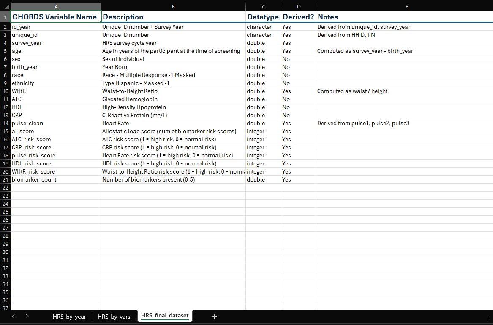
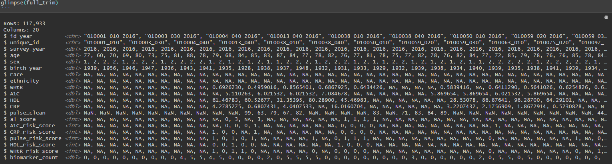

# HRS
*CHORDS Lab – Washington State University*  

_Last updated: [2025-07-15]_  

## Contents  

- [`HRS_access_guide.md`](HRS_access_guide.md)  
  Instructions for accessing and downloading raw data from the [Health and Retirement Study (HRS)](https://hrs.isr.umich.edu/).

- [`HRS_dataset_construction.Rmd`](HRS_dataset_construction.Rmd)  
  R Markdown script that compiles and processes HRS Core data across multiple waves (2006–2016), producing:
  - Cleaned and harmonized variables across waves
  - Cycle-specific risk thresholds for each biomarker
  - Biomarker-based risk scores
  - Waist-to-Height Ratio (`WHtR`)
  - Derived age at time of interview (`age`)
  - Total allostatic load score (`al_score`)
  - Biomarker availability per observation (`biomarker_count`)

- [`HRS_data_dictionary.xlsx`](HRS_data_dictionary.xlsx)
  An Excel workbook with three sheets:
  - `HRS_by_year`: Source HRS data organized by survey cycle/year
  - `HRS_by_vars`: Source HRS data organized by variable
  - `HRS_final_dataset`: Full list of variables in the constructed dataset, including all derived variables from [`HRS_dataset_construction.Rmd`](HRS_dataset_construction.Rmd)  
  >Useful for tracing each variable’s origin, understanding coding schemes, and reviewing how variables were cleaned or computed.

    

## Variable Naming Conventions  

The following conventions are used for variable names:  

| Category                 | Convention                           | Examples                                       |
|--------------------------|--------------------------------------|------------------------------------------------|
| Raw biomarkers           | Uppercase unless derived             | `CRP`, `A1C`, `HDL`, `WHtR`, `pulse_clean`     |
| Risk scores              | Biomarker name + `_risk_score`       | `CRP_risk_score`, `pulse_risk_score`           |
| General demographics     | Lowercase with snake_case            | `age`, `sex`, `survey_year`                    |
| Identifiers              | Lowercase with snake_case            | `unique_id`, `id_year`                         |
| Summary variables        | Lowercase with snake_case            | `al_score`, `biomarker_count`                  |

All variables are harmonized across waves. Original HRS variable names were renamed as needed for clarity and consistency.

## Final Dataset  

Below is a preview of the final HRS `full_trim` dataset, as shown using the `glimpse()` function in RStudio. This dataset is created in [`HRS_dataset_construction.Rmd`](HRS_dataset_construction.Rmd).

