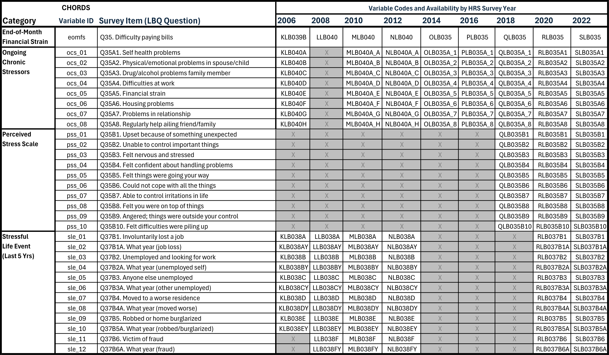
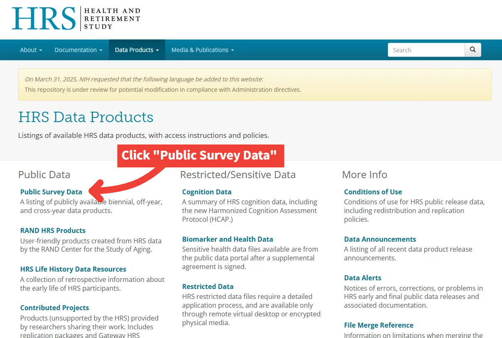
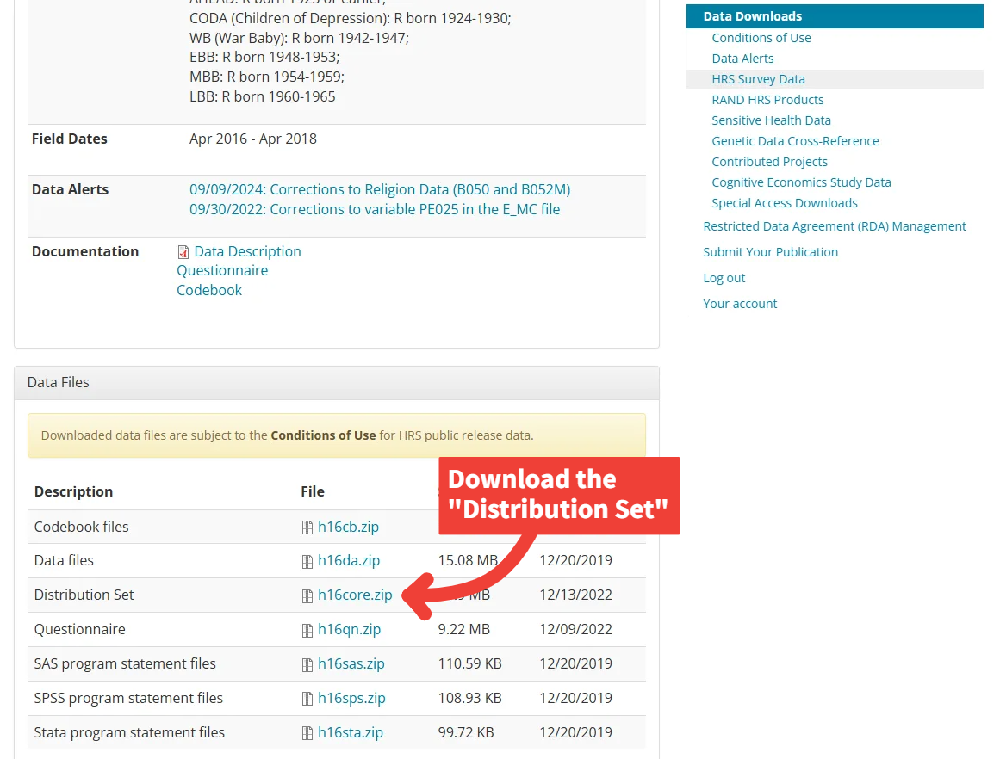

 

# HRS Stress Measures Data Access Guide  
*CHORDS Lab – Washington State University*

_Last updated: [2025-10-29]_

## 🔗 Related Document

For detailed variable descriptions, naming conventions, and background on the stress measures used in this dataset, see the [`HRS Stress Data Overview`](HRS_Stress_Data_Overview_DRAFT.pdf).

---

This guide walks through the process of downloading and organizing the raw **Health and Retirement Study (HRS)** stress data needed to run [`HRS_stress_dataset_construction.Rmd`](HRS_stress_dataset_construction.Rmd) and build the **HRS Stress Dataset**.

You can build the dataset in one of two ways:  

1. **Single-Year Build (custom)** – constructs the dataset for a single survey wave (e.g., 2016 only).  
2. **Longitudinal Build (2006 – 2022)** – combines multiple HRS waves into a single harmonized dataset.  

> Note: Both builds use the same folder structure and source data files. The only difference is **which year subfolders you download** and **which chunks you run** in the R Markdown script.

---

## 📁 Folder Structure & Required Files

Once you’ve downloaded and extracted the required files, your local directory should look like this:

    HRS Data Products/  
    ├── HRS Core Data/  
    │ ├── h06core/  
    │ ├── h08core/  
    │ ├── h10core/  
    │ ├── h12core/  
    │ ├── h14core/  
    │ └── h16core/  
    │ └── h18core/
    │ └── h20core/
    │ └── h22core/
      
> ### 💡 For a single-year build, you'll only need the subfolder for your selected wave (e.g., h16core/ for 2016). For a longitudinal build, download all waves you intend to include.  

---

### Table 1. HRS Stress Measures by Category and Survey Year

 

> *Note:* The *CHORDS Variable ID* column lists CHORDS Lab’s standardized variable names for each survey item, used to harmonize measures across waves. Cells containing a grayed-out “X” indicate that the item was **not collected** in that survey year.

 

---

# Accessing the HRS Data

## 1. Account Setup & Data Access Permissions

Before downloading, you'll need to:

1. Create an account at the [HRS website](https://hrs.isr.umich.edu/).

 

## 2. Download HRS Core Data

Visit the [HRS Public Survey Data](https://hrsdata.isr.umich.edu/data-products/public-survey-data) page and download the **Core Distribution Sets** corresponding to the year(s) you plan to include.

- **Longitudinal build:** Download all waves (2006 – 2022).
- **Single-year build:** Download only your target year.

  

 

Click the **HRS Core** link for each year you plan to include.

   

 

Download the **Distribution Set** for each year you plan to include.

  

#### Alternatively, you may use the following direct links to download each `HRS Core` distribution set you plan to include:
- [2006 HRS Core](https://hrsdata.isr.umich.edu/data-file-download/9482)
- [2008 HRS Core](https://hrsdata.isr.umich.edu/data-file-download/5435)
- [2010 HRS Core](https://hrsdata.isr.umich.edu/data-file-download/9465)
- [2012 HRS Core](https://hrsdata.isr.umich.edu/data-file-download/5446)
- [2014 HRS Core](https://hrsdata.isr.umich.edu/data-file-download/5448)
- [2016 HRS Core](https://hrsdata.isr.umich.edu/data-file-download/14963)  
- [2018 HRS Core](https://hrsdata.isr.umich.edu/data-file-download/14964)  
- [2020 HRS Core](https://hrsdata.isr.umich.edu/data-file-download/18721)  
- [2022 HRS Core](https://hrsdata.isr.umich.edu/data-file-download/26115)  

---

## 3. Unzipping HRS Core Data

**Setup Instructions:**
- Create a folder called `HRS Core Data/`
- Unzip each file into its own subfolder inside that directory (`h06core/`, `h08core/`, etc.)
- Each `.zip` file may contain nested `.zip` files—be sure to unzip those as well. If you're using a batch extractor, this will be handled automatically, but double-check that all subfolders are extracted

💡 _Need help unzipping multiple files at once?_ Try [7-Zip](https://www.7-zip.org/) (Windows) or [The Unarchiver](https://theunarchiver.com/) (Mac) for batch extraction.

---

## ✅ Setup Complete -- Proceed to Stress Dataset Construction

Once your data are downloaded and organized, you can build the dataset using:
- [`HRS_stress_dataset_construction.Rmd`](HRS_stress_dataset_construction.Rmd)

If you encounter issues or need assistance with data access or permissions, contact the [HRS Help Desk](https://hrs.isr.umich.edu/help).

