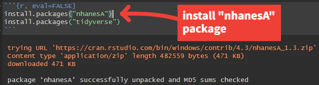

# NHANES Data Access Guide  
*CHORDS Lab – Washington State University*

_Last updated: [2025-06-28]_

This guide provides an overview of how to access the raw NHANES data used in our allostatic load pipeline. While NHANES data is publicly available and can be downloaded manually from the [CDC website](https://wwwn.cdc.gov/nchs/nhanes), this repository does **not** support manual downloading or local folder setup. Instead, all data access and compilation is handled programmatically via the [`nhanesA` R package](https://cran.r-project.org/web/packages/nhanesA/vignettes/Introducing_nhanesA.html), developed by **Christopher J. Endres** [^1], as outlined in [`NHANES_dataset_construction.Rmd`](NHANES_dataset_construction.Rmd).

[^1]: Endres, C. J. (2025). *Introducing nhanesA*. Retrieved from [https://cran.r-project.org/web/packages/nhanesA/vignettes/Introducing_nhanesA.html](https://cran.r-project.org/web/packages/nhanesA/vignettes/Introducing_nhanesA.html)

---

## ⚠️ Important Note About Manual Downloads

If you're familiar with NHANES and prefer to download `.XPT` files manually from the [CDC NHANES website](https://wwwn.cdc.gov/nchs/nhanes/default.aspx), you’re welcome to do so.

However, this repository does **not** include scripts or support for manually compiling or cleaning NHANES data (which can be tedious and error-prone).

To follow along with our workflow and generate the final dataset, you’ll need to use the `nhanesA` package in R. This allows for fast, reproducible access to the exact variables and years used in our analysis.

---

## What You'll Need

To use this workflow, you’ll need an R environment (e.g., [RStudio](https://posit.co/download/rstudio-desktop/)) set up on your machine. No account or registration is required to access NHANES data—everything is publicly available via the NHANES API and accessible through the `nhanesA` package.

Our preparation script [`NHANES_dataset_construction.Rmd`](NHANES_dataset_construction.Rmd) handles everything for you, including:

- Selecting survey cycles (e.g., 2015–2016, 2017–2018)
- Downloading variables by code
- Renaming and merging datasets
- Cleaning and recoding variables

---

## ✅ Setup Complete – Proceed to Dataset Construction

Once you've installed the required packages, you're ready to run [`NHANES_dataset_construction.Rmd`](NHANES_dataset_construction.Rmd) in the `/NHANES` directory.

This script will:

- Download all required NHANES data via `nhanesA`
- Apply preprocessing steps
- Output a cleaned dataset ready for downstream analysis

---

## Need Help?

If you run into any issues with the R package or variable codes:

- Browse the [NHANES Tutorials](https://wwwn.cdc.gov/nchs/nhanes/tutorials/default.aspx)
- Review the [`nhanesA` vignette on CRAN](https://cran.r-project.org/web/packages/nhanesA/vignettes/Introducing_nhanesA.html)

For variable names and documentation, you can also use the [NHANES Variable Search Tool](https://wwwn.cdc.gov/nchs/nhanes/Default.aspx).

---

