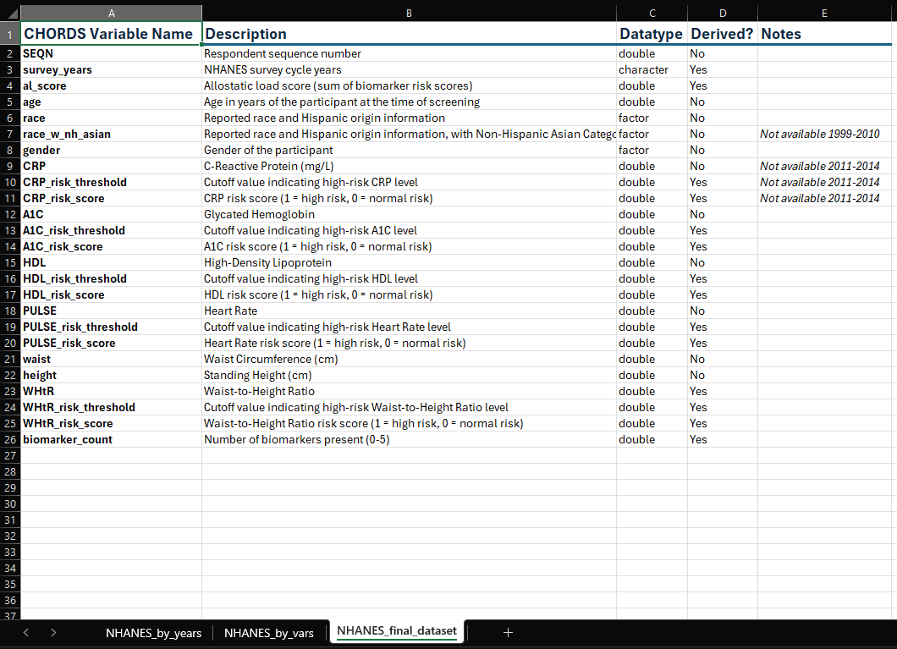
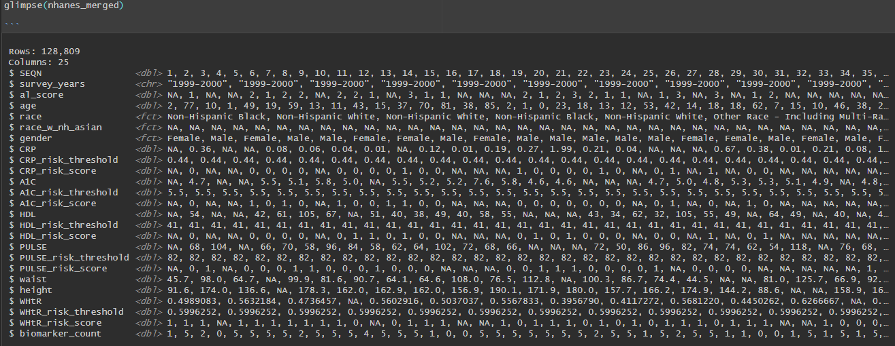

# NHANES
*CHORDS Lab – Washington State University*

_Last updated: [2025-07-24]_

## Contents

- [`NHANES_access_guide.md`](NHANES_access_guide.md)  
  Instructions for accessing and downloading raw NHANES data via the `nhanesA` package.

- [`NHANES_dataset_construction.Rmd`](NHANES_dataset_construction.Rmd)  
  R Markdown script that compiles NHANES data across multiple cycles (1999-2023) and derives the following:
  - Cycle-specific risk thresholds for each biomarker
  - Biomarker-based risk scores
  - Waist-to-Height Ratio (`WHtR`)
  - Total allostatic load score (`al_score`)
  - Biomarker availability per observation (`biomarker_count`)

- [`NHANES_data_dictionary.xlsx`](NHANES_data_dictionary.xlsx)
  An Excel workbook with three sheets:
  - `NHANES_by_years`: Source NHANES data organized by survey cycle/year
  - `NHANES_by_vars`: Source NHANES data organized by variable
  - `NHANES_final_dataset`: Full list of variables in the constructed dataset, including all derived variables from [`NHANES_dataset_construction.Rmd`](NHANES_dataset_construction.Rmd)  
  >Useful for tracing each variable’s origin, understanding coding schemes, and reviewing how variables were cleaned or computed.

    

## Variable Naming Conventions

The following conventions are used for variable names:

| Category                | Convention                         | Examples                                      |
|-------------------------|-------------------------------------|-----------------------------------------------|
| Biomarkers              | Uppercase                          | `CRP`, `A1C`, `HDL`, `PULSE`, `WHtR`          |
| Risk thresholds/scores  | Uppercase with snake_case suffixes | `CRP_risk_score`, `HDL_risk_threshold`        |
| General demographic     | Lowercase with snake_case           | `age`, `gender`, `survey_years`               |
| Identifiers             | Retained from NHANES                | `SEQN`                                        |
| Derived summary vars    | Lowercase with snake_case           | `al_score`, `biomarker_count`                 |

All variables are harmonized across cycles. Raw NHANES variables were renamed as needed for clarity and consistency.

## Final Dataset

The screenshot below shows the final `nhanes_merged` dataset, as previewed in RStudio using the `glimpse()` function. This dataset is constructed in [`NHANES_dataset_construction.Rmd`](NHANES_dataset_construction.Rmd).

