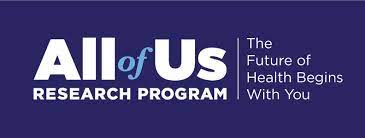

 

# NIH *All of Us* Access Guide  
*CHORDS Lab – Washington State University*

_Last updated: [2025-08-15]_

The code in [NIH_dataset_construction.ipynb](`NIH_dataset_construction.ipynb`) can **only** be used within the secure NIH *All of Us* Researcher Workbench environment.  

To run it, you will need to:  
- Be a **registered NIH *All of Us* researcher**  
- Use the NIH *All of Us* Cohort and Concept Set builders to generate starter code for your own `dataset_XXXXXXXX_measurement_df` and `dataset_XXXXXXXX_person_df` (IDs will vary)
- Run the code from **within your secure NIH Workbench**  

Registration and access details are available on the [*All of Us* Researcher Workbench website](https://workbench.researchallofus.org/).  

ℹ️ **Note:** A CHORDS Community Workspace within the NIH *All of Us* Researcher Workbench will be available soon. This will provide shared access to code and resources directly in the secure environment.