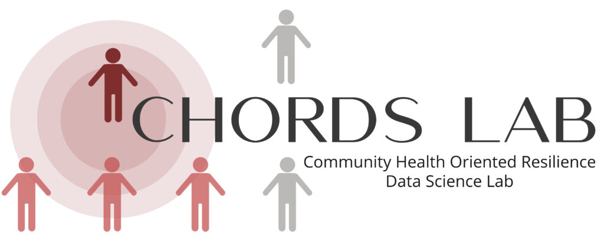

  

# CHORDSLab / Allostatic-over-Load-Repository 
>[labs.wsu.edu/chords](https://labs.wsu.edu/chords/)

_Last updated: August 4, 2025_

This repository contains guides and R scripts for generating datasets using [our data processing approach to allostatic (over)load](https://doi.org/10.1101/2025.07.31.25332519) from the following data sources:

- NIH *All of Us* Research Program data repository  
- Health and Retirement Study (HRS)  
- National Health and Nutrition Examination Survey (NHANES)  

---

## HRS Project Team & Timeline  
- Shawna Beese, Ph.D. RN 
- Jason Cross, B.S. Data Analytics
- David Rice, Ph.D. Student

Timeline: January 2025-present

## NHANES Project Team & Timeline 
- Shawna Beese, Ph.D. RN 
- Jason Cross, B.S. Data Analytics
- Mariah Bergquist, B.S. Data Analytics
- Maya Dietrich, B.S. Data Analytics
- William Ripplinger, B.S. Data Analytics
- Owen Williams, B.S. Data Analytics

Timeline: January 2025-present

## NIH <i>All of Us</i> Project Team & Timeline 
- Shawna Beese, Ph.D. RN 
- Jason Cross, B.S. Data Analytics
- David Rice, Ph.D. Student
- Trey DeJong, Ph.D.

Timeline: September 2024-present

## Key Dates:  
- Overall project conception: August 2024
- NIH *All of Us* project started using V.7 data in the All of Us workbench: September 2024 (Jupyter Notebook)
- Posit Cloud project space created for HRS project: January 15, 2025
- NHANES project: first project meeting with Dr. Shawna Beese and team: February 4, 2025.
- HRS data standardization and code/documentation review initiated by Jason Cross: June 6, 2025 
- Preprint protocol manuscript posted to *medRxiv*: July 31, 2025
- Initial public GitHub repository published: July 31, 2025

## Project Objectives  
- Develop a repository featuring R scripts and instructions to develop allostatic (over)load data from: 
    - NIH *All of Us* (cross-sectional), 
    - Health and Retirement Study (HRS; longitudinal), and 
    - National Health and Nutrition Examination Survey (NHANES; quasi-longitudinal)

## Allostatic Load Biomarker Panel  
The project uses a five-biomarker index based on scientific consensus (McCrory et al. 2023)

- C-reactive protein (CRP)
- Glycated hemoglobin (A1C)
- High-density lipoprotein (HDL)
- Heart rate
- Waist-to-height ratio (WHtR)

Each biomarker is coded as high or normal risk based on top/bottom quartiles or clinical cutoffs and summed to generate a composite score (0-5) per participant.

## Protocol
 Our lab’s protocol for calculating allostatic (over)load is described in detail in our [preprint on medRxiv](https://doi.org/10.1101/2025.07.31.25332519). It outlines our rationale, data sources, and step-by-step processing workflow for generating analysis-ready datasets from large-scale health surveys.
 [https://doi.org/10.1101/2025.07.31.25332519](https://doi.org/10.1101/2025.07.31.25332519)  

## Usage 
**When using this protocol, workflow, or any portion of this repository, please cite:**:  
Beese S, Cross J, Rice D, & DeJong TL (2025). *Allostatic (over)Load Measurement: Workflow and repository*. [https://doi.org/10.1101/2025.07.31.25332519](https://doi.org/10.1101/2025.07.31.25332519)

## Repository Contents
Below is an overview of the main folders in this repository, with links and brief descriptions of their contents.

| Folder | Description |
|--------|-------------|
| [`/HRS`](./HRS/) | Scripts and instructions for downloading, cleaning, and preparing HRS data across multiple waves (2006–2016) |
| [`/NHANES`](./NHANES/) | Scripts and instructions for downloading, cleaning, and preparing NHANES data across multiple survey cycles (1999–2023) |
| [`/NIH_All_of_Us`](./NIH_All_of_Us/) | Scripts for cleaning and formatting NIH *All of Us* data. This section is under development |
| [`/docs`](./docs/) | Project documentation and internal reference materials |

